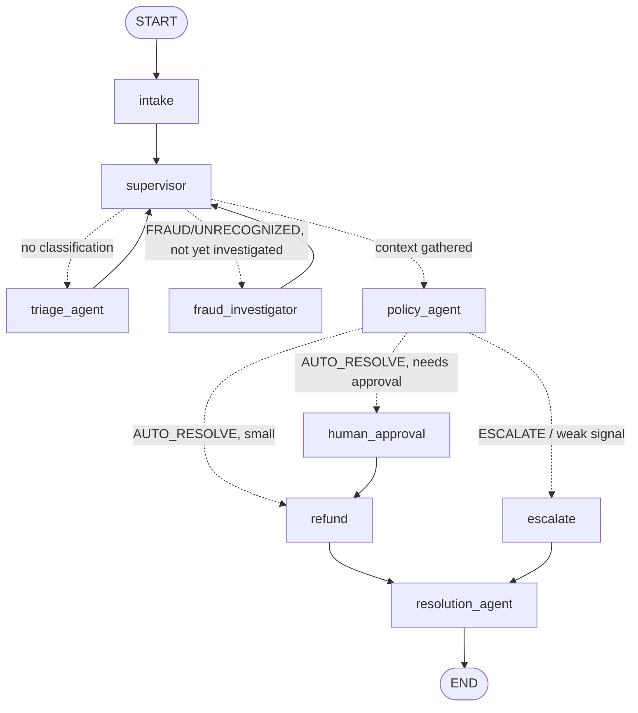

# Dispute & Chargeback Resolution Agent (LangGraph, multi-agent)

A production-style LangGraph project that resolves customer payment disputes for an Indian retail bank. A **supervisor** orchestrates a team of specialist agents that coordinate purely through shared graph state: triage the dispute, investigate fraud with a tool-calling agent, apply deterministic bank policy, gate high-value refunds behind a human, and draft the customer-facing reply.

Built to teach **Sections 3-5**: nodes/edges/state machines, the Python SDK & node config with a unit-test strategy, and the multi-agent + context-handling concepts.

> Tested against **LangGraph 1.2.x / LangChain 1.3.x / langchain-openai 1.4.x**, Python 3.10+. **52 tests, all offline, ~1s.**

---

## What it demonstrates

| Concept | Where it lives |
|---|---|
| **State** (shared `TypedDict`, reducers) | `state.py` |
| **Nodes / handlers** (injected deps) | `nodes.py`, `agents/` |
| **Edges + transitions** (linear, conditional, loop) | `graph.py`, `routers.py` |
| **State machine** (retry loop + triage loop + 3-way branch + HITL) | `graph.py` |
| **Multi-agent via shared state** | `agents/`, `state.py` (ownership contract) |
| **Dynamic task allocation** (supervisor) | `agents/specialists.py::make_supervisor` |
| **LangChain tools inside LangGraph** (full tool loop) | `tools.py`, `agents/fraud_investigator.py` |
| **Context: memory / buffer / shared state** | checkpointer, `scratchpad.py`, `state.py` |
| **Prompt engineering for modular agents** | `prompts.py` |
| **Unit testing** (tools, agents, routers, graph) | `tests/` |
| **Mock data via a repository** | `data/*.json`, `data_access.py` |

---

## The multi-agent graph



**The agents (they coordinate only via shared `DisputeState`):**
- **Supervisor** — reads state, decides which agent runs next (dynamic allocation). A clean duplicate skips fraud investigation; a fraud case always gets investigated; low-confidence triage loops back (bounded).
- **Triage Agent** — LLM boundary; classifies the dispute (DUPLICATE / FRAUD / SERVICE_NOT_RENDERED / UNRECOGNIZED / OTHER).
- **Fraud Investigator** — a **full tool-calling loop**: the model calls `lookup_transaction`, `lookup_merchant`, `lookup_customer_history`, `compute_fraud_signals` as needed, then returns a verdict.
- **Policy Agent** — deterministic, auditable bank policy (the decision engine).
- **Resolution Agent** — drafts the courteous customer-facing message.

**The inter-agent buffer** (`agent_messages`) is a running log each agent appends to, so later agents — and the human reviewer — can see the "conversation":

```
[supervisor] -> triage_agent (no classification yet)
[triage] category=FRAUD conf=0.90
[supervisor] -> fraud_investigator (FRAUD needs fraud investigation)
[fraud_investigator] score=1.0, signals=[...], evidence=STRONG
[supervisor] -> policy_agent (context gathered, ready for policy decision)
[policy] AUTO_RESOLVE - Fraud signals strong (score=1.0); provisional refund.
[resolution] drafted customer message
```

---

## Setup

```bash
cd dispute_resolution
python3 -m venv .venv && source .venv/bin/activate     # Windows: .venv\Scripts\activate
pip install -r requirements.txt
cp .env.example .env      # then paste your OPENAI_API_KEY (only needed for live mode)
```

## Run it

```bash
# MULTI-AGENT, fully offline (stub agents + scripted tool loop, no API key):
python cli.py --all --offline

# One fraud case with the inter-agent buffer shown, auto-approving the gate:
python cli.py --dispute DSP003 --offline --approve yes --show-buffer

# Contrast with the ORIGINAL single-agent linear pipeline:
python cli.py --dispute DSP003 --offline --linear --approve yes

# Show the linear pipeline's retry loop (fail the fraud service twice, then recover):
python cli.py --dispute DSP001 --offline --linear --fraud-fails 2

# LIVE OpenAI: real triage, real tool-calling investigator, real message (needs key):
python cli.py --dispute DSP003
```

The four bundled disputes each take a different path:

| Dispute | Category | Path | Outcome |
|---|---|---|---|
| DSP001 | DUPLICATE (Rs.8,000) | skips investigation | auto-refund |
| DSP002 | SERVICE_NOT_RENDERED | skips investigation | escalate |
| DSP003 | FRAUD (Rs.65,000) | investigator -> strong signals | refund **after human approval** |
| DSP004 | UNRECOGNIZED (weak signals) | investigator -> weak signals | escalate |

## Test it

```bash
pytest                          # 52 tests, all offline
pytest tests/test_supervisor.py # dynamic task allocation
pytest tests/test_investigator.py  # tools + full tool loop
pytest tests/test_context.py    # buffer + memory isolation
```

---

## Project layout

```
dispute_resolution/
├── cli.py                        # runner: multi-agent + --linear contrast, --show-buffer
├── data/                         # mock banking data as JSON
│   ├── disputes.json  transactions.json  customers.json  merchants.json
├── src/dispute_agent/
│   ├── state.py                  # DisputeState + reducers + ownership contract
│   ├── config.py                 # thresholds & model name in one place
│   ├── data_access.py            # JsonRepository / InMemoryRepository
│   ├── classifier.py             # OpenAIClassifier + StubClassifier (triage boundary)
│   ├── fraud.py                  # pure score_fraud() + flaky FraudService
│   ├── tools.py                  # LangChain @tool wrappers (used inside the graph)
│   ├── prompts.py                # modular per-agent prompts
│   ├── scratchpad.py             # inter-agent buffer helpers
│   ├── dependencies.py           # injectable dependency bundle
│   ├── nodes.py                  # intake + terminal + legacy linear nodes
│   ├── routers.py                # conditional-edge transition functions
│   ├── graph.py                  # build_graph (multi-agent) + build_linear_graph
│   └── agents/
│       ├── supervisor/triage/policy/resolution  (specialists.py)
│       ├── fraud_investigator.py # tool-calling agent as a subgraph node
│       └── scripted_model.py     # offline scripted tool-calling model
└── tests/                        # data / fraud / nodes / routers / graph
                                  # + supervisor / investigator / context
```

---

## Design notes

**Multi-agent coordination is state-only.** No agent calls another. The supervisor writes `next_agent`; a router reads it. Workers write their slice of state and return to the supervisor. This is what keeps each agent independently testable and the flow easy to reason about.

**The tool loop is real, and it runs offline.** The Fraud Investigator is a genuine `agent <-> ToolNode` loop built with `bind_tools` + `tools_condition`. In production a `ChatOpenAI` model drives it; offline a `ScriptedToolModel` drives the identical wiring, so the graph you test is the graph you ship.

**Dependency injection everywhere.** Agents receive a `Dependencies` bundle (repo, classifier, fraud service, message writer). Production wires OpenAI + JSON files; tests wire stubs + in-memory data. That single seam is why all 52 tests run offline in about a second, and it is the same seam you would use to swap OpenAI for Bedrock or Azure.

**Two pipelines, on purpose.** `build_linear_graph` preserves the original single-agent design (with the fraud-service retry loop) for teaching contrast against the `build_graph` multi-agent version.
